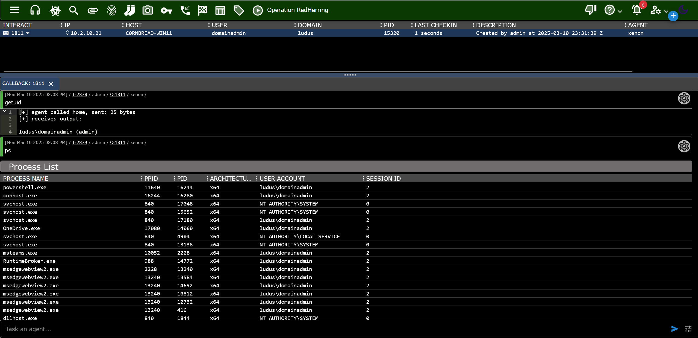

<div align="center">
  
  <h1>Xenon</h1>
  <br/>

  <p><i>Xenon is a Cobalt Strike-like Windows agent for Mythic, created by <a href="https://github.com/nickswink">@c0rnbread</a>.</i></p>
  <br />

  <br />
</div>

> :warning: Xenon is in an early state of release. It is not opsec safe and likely contains memory leaks and other issues causing crashes. Test thoroughly if planning to use in a live environment.

## Quick Start
Installing Xenon on an already existing Mythic server is very easy. If you do not have a Mythic server set up yet, to do that go to [Mythic project page](https://github.com/its-a-feature/Mythic/).

From the Mythic install directory, use the following command to install Xenon as the **root** user:

```
./mythic-cli install github https://github.com/MythicAgents/Xenon.git
```

From the Mythic install directory, use the following command to install Xenon as a **non-root** user:

```
sudo -E ./mythic-cli install github https://github.com/MythicAgents/Xenon.git
```

## Features
- Modular command inclusion
- Malleable C2 Profiles w/ [httpx](https://github.com/MythicC2Profiles/httpx)
- Compatible with Cobalt Strike post-ex BOFs

### OPSEC Disclaimer
Xenon makes no claims about evasion. In fact it is not OPSEC safe. There are many OPSEC improvements that need to be made to the agent. The main purpose of the project was to learn C and Windows internals better, not create the next FUD implant.


## Supported Commands

| Command         | Usage                                               | Description |
|----------------|-----------------------------------------------------|-------------|
| `pwd`          | `pwd`                                               | Show present working directory. |
| `ls`           | `ls [path]`                                    | List directory information for `<directory>`. |
| `cd`           | `cd <directory>`                           | Change working directory. |
| `cp`           | `cp <source file> <destination file>`             | Copy a file to a new destination. |
| `rm`           | `rm <path\|file>`                     | Remove a directory or file. |
| `mkdir`        | `mkdir <path>`                            | Create a new directory. |
| `getuid`       | `getuid`                                            | Get the current identity. |
| `make_token`   | `make_token <DOMAIN> <username> <password> [LOGON_TYPE]` | Create a token and impersonate it using plaintext credentials. |
| `steal_token`  | `steal_token <pid>`                                 | Steal and impersonate the token of a target process. |
| `rev2self`     | `rev2self`                                          | Revert identity to the original process's token. |
| `ps`           | `ps`                                                | List host processes. |
| `shell`        | `shell <command>`                                   | Runs `{command}` in a terminal. |
| `sleep`        | `sleep <seconds> [jitter]`                          | Change sleep timer and jitter. |
| `inline_execute` | `inline_execute -BOF [COFF.o] [-Arguments [optional arguments]]` | Execute a Beacon Object File in the current process thread. **Warning:** Incorrect argument types can crash the Agent process. |
| `download`     | `download -path <file path>`                           | Download a file off the target system (supports UNC path). |
| `upload`       | `upload (modal)`                                            | Upload a file to the target machine by selecting a file from your computer. |
| `status`         | `status`                                              | List C2 connection hosts and their status. |
| `exit`         | `exit`                                              | Task the implant to exit. |

---

### Module Commands (BOFs)
These are optional commands that call `inline_execute` under the hood with specific BOFs.

**Some** BOFs from the [CS-Situational-Awareness-BOF](https://github.com/trustedsec/CS-Situational-Awareness-BOF) collection have been added.
Credits to [@trustedsec](https://github.com/trustedsec) for these.

| Command                  | Usage                                                         | Description |
|--------------------------|---------------------------------------------------------------|-------------|
| `sa_adcs_enum`          | `sa_adcs_enum`                                               | **[SituationalAwareness]** Enumerate CAs and templates in the AD using Win32 functions. |
| `sa_arp`                | `sa_arp`                                                    | **[SituationalAwareness]** List ARP table. |
| `sa_driversigs`         | `sa_driversigs`                                            | **[SituationalAwareness]** Enumerate installed services' image paths to check signing certs against known AV/EDR vendors. |
| `sa_get_password_policy` | `sa_get_password_policy [hostname]`                        | **[SituationalAwareness]** Get the configured password policy and lockouts for the target server or domain. |
| `sa_ipconfig`           | `sa_ipconfig`                                              | **[SituationalAwareness]** List IPv4 address, hostname, and DNS server. |
| `sa_ldapsearch`         | `sa_ldapsearch [query] [opt: attribute] [opt: results_limit] [opt: DC hostname or IP] [opt: Distinguished Name]` | **[SituationalAwareness]** Execute LDAP searches. Specify `*,ntsecuritydescriptor` as an attribute parameter for all attributes and base64 encoded ACL of objects (useful for BOFHound). |
| `sa_list_firewall_rules`| `sa_list_firewall_rules`                                   | **[SituationalAwareness]** List Windows firewall rules. |
| `sa_listmods`           | `sa_listmods [opt: pid]`                                   | **[SituationalAwareness]** List process modules (DLLs). Targets the current process if no PID is specified. Complements `sa_driversigs` for AV/EDR injection detection. |
| `sa_netshares`          | `sa_netshares [hostname]`                                 | **[SituationalAwareness]** List shared resources on the local or remote computer. |
| `sa_netstat`            | `sa_netstat`                                             | **[SituationalAwareness]** List active TCP and UDP connections. |
| `sa_netuser`            | `sa_netuser [username] [opt: domain]`                    | **[SituationalAwareness]** Get detailed information about a specific user. |
| `sa_nslookup`           | `sa_nslookup [hostname] [opt:dns server] [opt: record type]` | **[SituationalAwareness]** Perform a DNS query. Supports specifying a custom DNS server and record type (e.g., A, AAAA, ANY). |
| `sa_probe`              | `sa_probe [host] [port]`                                 | **[SituationalAwareness]** Check if a specific port is open. |
| `sa_whoami`             | `sa_whoami`                                             | **[SituationalAwareness]** List `whoami /all`. |


## Supported C2 Profiles

### [HTTPX Profile](https://github.com/MythicC2Profiles/httpx)

I really wanted to support the HTTPX C2 Profile, since it allows the operator to configure malleable C2 profiles similar to Cobalt Strike. At the time of making Xenon, there was only one Mythic agent that supported the HTTPX profile.

Xenon currently supports these features of the HTTPX profile:

* Callback Domains (array of values)
* Domain Rotation (fail-over and round-robin)
* Domain Fallback Threshold (for fail-over how many failed attempts before moving to the next)
* Callback Jitter and Sleep intervals
* Agent Message and Server Response configurations provided via JSON or TOML files at Build time that offer:
  * Message location in cookies, headers, query parameters, or body
  * Message transforms with base64, base64url, append, prepend, xor
  * Custom Client/Server headers
  * Custom Client query parameters

**Note** - Features of HTTPX that are *not* currently supported in Xenon:

* Message transforms netbios and netbiosu
* Adding an arbitrary `Host` header
* POST request payload location (only body is supported)
* Multiple URI connection strings (only uses first one for now)

If you try to use these in your malleable profile config, it will either **not work** or **break stuff**.

Here's an example of a malleable profile for HTTP(S) traffic:

```JSON
{
        "name": "jQuery TEST",
        "get": {
            "verb": "GET",
            "uris": [
                "/jquery-3.3.1.min.js"
            ],
            "client": {
                "headers": {
                    "Accept": "text/html,application/xhtml+xml,application/xml;q=0.9,*/*;q=0.8",
                    "Accept-Encoding": "gzip, deflate",
                    "Connection": "Keep-Alive",
                    "Keep-Alive": "timeout=10, max=100",
                    "Referer": "http://code.jquery.com/",
                    "User-Agent": "Mozilla/5.0 (Windows NT 6.3; Trident/7.0; rv:11.0) like Gecko"
                },
                "parameters": null,
                "message": {
                    "location": "cookie",
                    "name": "__cfduid"
                },
                "transforms": [
                    {
                        "action": "base64url",
                        "value": ""
                    }
                ]
            },
            "server": {
                "headers": {
                    "Cache-Control": "max-age=0, no-cache",
                    "Connection": "keep-alive",
                    "Content-Type": "application/javascript; charset=utf-8",
                    "Pragma": "no-cache",
                    "Server": "NetDNA-cache/2.2"
                },
                "transforms": [
                    {
                        "action": "xor",
                        "value": "randomKey"
                    },
                    {
                        "action": "base64url",
                        "value": ""
                    },
                    {
                        "action": "prepend",
                        "value": "/*! jQuery v3.3.1 | (c) JS Foundation and other contributors | jquery.org/license */"
                    },
                    {
                        "action": "append",
                        "value": "\".(o=t.documentElement,Math.max(t.body[\"scroll\"+e],o[\"scroll\"+e],t.body[\"offset\"+e],o[\"offset\"+e],o[\"client\"+e])):void 0===i?w.css(t,n,s):w.style(t,n,i,s)},t,a?i:void 0,a)}})}),w.each(\"blur focus focusin focusout resize scroll click dblclick mousedown mouseup mousemove mouseover mouseout mouseenter mouseleave change select submit keydown keypress keyup contextmenu\".split(\" \"),function(e,t){w.fn[t]=function(e,n){return arguments.length>0?this.on(t,null,e,n):this.trigger(t)}}),w.fn.extend({hover:function(e,t){return this.mouseenter(e).mouseleave(t||e)}}),w.fn.extend({bind:function(e,t,n){return this.on(e,null,t,n)},unbind:function(e,t){return this.off(e,null,t)},delegate:function(e,t,n,r){return this.on(t,e,n,r)},undelegate:function(e,t,n){return 1===arguments.length?this.off(e,\"**\"):this.off(t,e||\"**\",n)}}),w.proxy=function(e,t){var n,r,i;if(\"string\"==typeof t&&(n=e[t],t=e,e=n),g(e))return r=o.call(arguments,2),i=function(){return e.apply(t||this,r.concat(o.call(arguments)))},i.guid=e.guid=e.guid||w.guid++,i},w.holdReady=function(e){e?w.readyWait++:w.ready(!0)},w.isArray=Array.isArray,w.parseJSON=JSON.parse,w.nodeName=N,w.isFunction=g,w.isWindow=y,w.camelCase=G,w.type=x,w.now=Date.now,w.isNumeric=function(e){var t=w.type(e);return(\"number\"===t||\"string\"===t)&&!isNaN(e-parseFloat(e))},\"function\"==typeof define&&define.amd&&define(\"jquery\",[],function(){return w});var Jt=e.jQuery,Kt=e.$;return w.noConflict=function(t){return e.$===w&&(e.$=Kt),t&&e.jQuery===w&&(e.jQuery=Jt),w},t||(e.jQuery=e.$=w),w});"
                    }
                ]
            }
        },
        "post": {
            "verb": "POST",
            "uris": [
                "/jquery-3.3.2.min.js"
            ],
            "client": {
                "headers": {
                    "Accept": "text/html,application/xhtml+xml,application/xml;q=0.9,*/*;q=0.8",
                    "Accept-Encoding": "gzip, deflate",
                    "Referer": "http://code.jquery.com/",
                    "User-Agent": "Mozilla/5.0 (Windows NT 6.3; Trident/7.0; rv:11.0) like Gecko"
                },
                "parameters": null,
                "message": {
                    "location": "body",
                    "name": ""
                },
                "transforms": [
                    {
                        "action": "xor",
                        "value": "someOtherRandomKey"
                    }
                ]
            },
            "server": {
                "headers": {
                    "Cache-Control": "max-age=0, no-cache",
                    "Connection": "keep-alive",
                    "Content-Type": "application/javascript; charset=utf-8",
                    "Pragma": "no-cache",
                    "Server": "NetDNA-cache/2.2"
                },
                "transforms": [
                    {
                        "action": "xor",
                        "value": "yetAnotherSomeRandomKey"
                    },
                    {
                        "action": "base64url",
                        "value": ""
                    },
                    {
                        "action": "prepend",
                        "value": "/*! jQuery v3.3.1 | (c) JS Foundation and other contributors | jquery.org/license */"
                    },
                    {
                        "action": "append",
                        "value": "\".(o=t.documentElement,Math.max(t.body[\"scroll\"+e],o[\"scroll\"+e],t.body[\"offset\"+e],o[\"offset\"+e],o[\"client\"+e])):void 0===i?w.css(t,n,s):w.style(t,n,i,s)},t,a?i:void 0,a)}})}),w.each(\"blur focus focusin focusout resize scroll click dblclick mousedown mouseup mousemove mouseover mouseout mouseenter mouseleave change select submit keydown keypress keyup contextmenu\".split(\" \"),function(e,t){w.fn[t]=function(e,n){return arguments.length>0?this.on(t,null,e,n):this.trigger(t)}}),w.fn.extend({hover:function(e,t){return this.mouseenter(e).mouseleave(t||e)}}),w.fn.extend({bind:function(e,t,n){return this.on(e,null,t,n)},unbind:function(e,t){return this.off(e,null,t)},delegate:function(e,t,n,r){return this.on(t,e,n,r)},undelegate:function(e,t,n){return 1===arguments.length?this.off(e,\"**\"):this.off(t,e||\"**\",n)}}),w.proxy=function(e,t){var n,r,i;if(\"string\"==typeof t&&(n=e[t],t=e,e=n),g(e))return r=o.call(arguments,2),i=function(){return e.apply(t||this,r.concat(o.call(arguments)))},i.guid=e.guid=e.guid||w.guid++,i},w.holdReady=function(e){e?w.readyWait++:w.ready(!0)},w.isArray=Array.isArray,w.parseJSON=JSON.parse,w.nodeName=N,w.isFunction=g,w.isWindow=y,w.camelCase=G,w.type=x,w.now=Date.now,w.isNumeric=function(e){var t=w.type(e);return(\"number\"===t||\"string\"===t)&&!isNaN(e-parseFloat(e))},\"function\"==typeof define&&define.amd&&define(\"jquery\",[],function(){return w});var Jt=e.jQuery,Kt=e.$;return w.noConflict=function(t){return e.$===w&&(e.$=Kt),t&&e.jQuery===w&&(e.jQuery=Jt),w},t||(e.jQuery=e.$=w),w});"
                    }
                ]
            }
        }
    }
```

## Roadmap
If you have suggestions/requests open an issue or you can message me on discord.

- [ ] Work on memory issues (duplicate buffers etc)
- [ ] `execute_assembly` command
- [ ] Lateral movement related commands
- [ ] `powershell` command


## Credits

I referenced and copied code from a bunch of different projects in the making of this project. If I directly copied code or only made slight modifications, I tried to add detailed references in the comments. Hopefully I didn't miss anything and piss someone off. 

- https://github.com/Red-Team-SNCF/ceos
- https://github.com/MythicAgents/Apollo
- https://github.com/MythicAgents/Athena
- https://github.com/kyxiaxiang/Beacon_Source
- https://github.com/HavocFramework/Havoc/tree/main/payloads/Demon
- https://github.com/Ap3x/COFF-Loader
- https://github.com/kokke/tiny-AES-c
